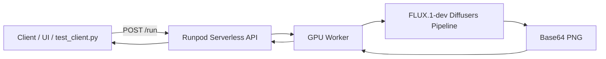

# Runpod FLUX.1-dev Serverless Endpoint

[](https://python.org)
[](https://www.runpod.io)
[](LICENSE)

A production-ready, dual-deployment serverless endpoint for [black-forest-labs/FLUX.1-dev](https://huggingface.co/black-forest-labs/FLUX.1-dev) image generation on the Runpod GPU cloud. It supports both **Runpod Flash** (no-container, rapid serverless deploy) and a classic **Docker worker** for full reproducibility and BYOC workflows.

## Files

- **`handler.py`** — Classic Runpod serverless handler (Docker path). Lazy-loads the FLUX.1-dev Diffusers pipeline once per worker.
- **`Dockerfile`** — Production container image for the classic Docker path.
- **`docker_requirements.txt`** — Python dependencies for the classic Docker path, including CUDA 12.1 wheels.
- **`flash_app.py`** — Runpod Flash endpoint for FLUX.1-dev (no Dockerfile required).
- **`pyproject.toml`** — Declares the `runpod-flash` build dependency.
- **`test_client.py`** — Python CLI to submit a prompt and poll for the generated image.
- **`build_push.sh`** — Helper to build and push the Docker image.
- **`ui/`** — Standalone high-end React-style browser frontend for interactively calling the endpoint.
- **`server.py`** — Flask proxy server for hosting the UI without exposing the Runpod API key.
- **`server_requirements.txt`** — Python dependencies for `server.py`.
- **`assets/`** — Demo artifacts (e.g., generated images).
- **`.env.example`** — Environment variable template.

## Architecture



- **Dual deployment**: `flash_app.py` is deployed via Runpod Flash for fast, no-Docker iteration. `handler.py` + `Dockerfile` provide a portable container image for BYOC or reproducible environments.
- **Model loading**: The Diffusers `FluxPipeline` is loaded once per worker and cached as a singleton. `enable_model_cpu_offload()` and `enable_vae_slicing()` keep VRAM usage within Runpod serverless constraints.
- **Input contract**: All endpoints accept a JSON `input` object with `prompt`, `negative_prompt`, `num_inference_steps`, `guidance_scale`, `height`, `width`, and `seed`.
- **Output contract**: Successful jobs return `{ image: '<base64-png>', inference_time_seconds: ... }` plus the input parameters.

## Quick Start

1. **Accept the FLUX.1-dev license** on Hugging Face and obtain a Hugging Face access token.
2. **Sign up for Runpod** and request free credits.
3. **Choose a deployment path:**
   - **Flash (no Docker):** See [Deploy with Runpod Flash](#deploy-with-runpod-flash-no-docker).
   - **Classic Docker:** See [Build & Push the Docker Image](#build--push-the-docker-image).
4. **Run a test request** with `test_client.py` or `curl`.

## Deploy with Runpod Flash (No Docker)

[Runpod Flash](https://docs.runpod.io/flash/overview) is Runpod's framework that lets you deploy Python functions to Serverless endpoints without writing a Dockerfile.

Install and authenticate:

```bash
pip install runpod-flash
flash login
```

Set your secrets:

```bash
cp .env.example .env
# Edit .env and add HF_TOKEN and RUNPOD_API_KEY
```

Run locally for development/testing:

```bash
flash dev
```

Deploy to Runpod Serverless:

```bash
flash deploy
```

Flash will read `flash_app.py`, bundle the declared `dependencies`, provision GPU workers (`ADA_24`, `AMPERE_24`, or `AMPERE_80`), and expose the function as a real `/run` and `/runsync` endpoint. The endpoint name is `flux1-dev-flash`.

### Calling the Flash endpoint

```bash
curl -X POST https://api.runpod.ai/v2/<endpoint-id>/run \
  -H "Content-Type: application/json" \
  -H "Authorization: Bearer $RUNPOD_API_KEY" \
  -d '{
    "input": {
      "prompt": "A serene mountain lake at sunrise, highly detailed, 8k",
      "negative_prompt": "blurry, low quality",
      "num_inference_steps": 28,
      "guidance_scale": 3.5,
      "height": 1024,
      "width": 1024,
      "seed": 42
    }
  }'
```

Or use the test client (the response field is `image`):

```bash
python test_client.py \
  --endpoint-id <endpoint-id> \
  --api-key $RUNPOD_API_KEY \
  --prompt "A serene mountain lake at sunrise, highly detailed, 8k" \
  --output output.png
```

## Build & Push the Image

```bash
export DOCKER_USERNAME=your-dockerhub-username
export IMAGE_NAME=flux1-dev-runpod-serverless
export TAG=v1.0.0
chmod +x build_push.sh
./build_push.sh
```

Or manually:

```bash
docker build -t your-dockerhub-username/flux1-dev-runpod-serverless:v1.0.0 .
docker push your-dockerhub-username/flux1-dev-runpod-serverless:v1.0.0
```

## Runpod Endpoint Configuration

Create a new **Serverless Endpoint** in the Runpod console and set:

- **Container Image:** `your-dockerhub-username/flux1-dev-runpod-serverless:v1.0.0`
- **Container Disk:** at least `50 GB`
- **Workers:** configure as desired (e.g., `1` min, `2` max)
- **GPU:** Select a high-VRAM GPU (FLUX.1-dev requires ~24 GB VRAM; e.g., RTX 4090 / A100 / L40S / H100)
- **Environment Variables:**
  - `HF_TOKEN` — your Hugging Face token (required for gated model access)
  - `MODEL_ID` — defaults to `black-forest-labs/FLUX.1-dev`
  - `DEFAULT_NUM_INFERENCE_STEPS` — defaults to `28`
  - `DEFAULT_GUIDANCE_SCALE` — defaults to `3.5`
  - `DEFAULT_HEIGHT` — defaults to `1024`
  - `DEFAULT_WIDTH` — defaults to `1024`

## Request Format

### Sync request

```bash
curl -X POST https://api.runpod.ai/v2/<endpoint-id>/run \
  -H "Content-Type: application/json" \
  -H "Authorization: Bearer $RUNPOD_API_KEY" \
  -d '{
    "input": {
      "prompt": "A serene mountain lake at sunrise, highly detailed, 8k",
      "negative_prompt": "blurry, low quality",
      "num_inference_steps": 28,
      "guidance_scale": 3.5,
      "height": 1024,
      "width": 1024,
      "seed": 42
    }
  }'
```

### Using the test client

```bash
pip install requests
python test_client.py \
  --endpoint-id <your-endpoint-id> \
  --api-key $RUNPOD_API_KEY \
  --prompt "A serene mountain lake at sunrise, highly detailed, 8k" \
  --output output.png
```

The response contains a base64-encoded PNG:

```json
{
  "image": "iVBORw0KGgoAAAA...",
  "prompt": "A serene mountain lake at sunrise, highly detailed, 8k",
  "inference_time_seconds": 12.34
}
```

## Frontend UI

Two UI options are provided:

### Static UI (`ui/index.html`)

Open `ui/index.html` in a browser to call the Runpod API directly. You need the endpoint ID and API key in the form. This is useful for local development.

### Hosted UI for recruiters (`server.py`)

The included Flask server (`server.py`) hides your Runpod API key and streams the live console log to the browser via Server-Sent Events. Recruiters only need the hosted URL; the server reads `RUNPOD_API_KEY` and `RUNPOD_ENDPOINT_ID` from environment variables.

Run locally:

```bash
cp .env.example .env
# fill in RUNPOD_API_KEY and RUNPOD_ENDPOINT_ID
pip install -r server_requirements.txt
python server.py
```

Then open `http://localhost:5000`.

Deploy to Render / Railway / Fly.io:
- Set environment variables `RUNPOD_API_KEY` and `RUNPOD_ENDPOINT_ID`.
- Use build command `pip install -r server_requirements.txt` and start command `gunicorn -w 1 server:app`.
- Share the public URL.

**Warning:** every generation consumes Runpod credits. Keep scale-to-zero enabled and warn reviewers about cost.

## Production, Security & Cost Notes

- `enable_model_cpu_offload()` lowers steady-state VRAM but adds per-request CPU<->GPU transfer. For max throughput, remove it and use a 24+ GB GPU.
- `enable_vae_slicing()` reduces VAE memory for resolutions >1024×1024.
- **Security**: never commit `.env`. The `.env` file is ignored; copy `.env.example` and populate locally. The UI stores API credentials only in browser memory for the session.
- **Cost**: Use `flash dev` for local iteration and `flash deploy` production with scale-to-zero workers. First cold start triggers a large model download; subsequent calls reuse the worker and pipeline singleton.
- **FLUX.1-dev** is a gated model; a valid `HF_TOKEN` with accepted license is required.
